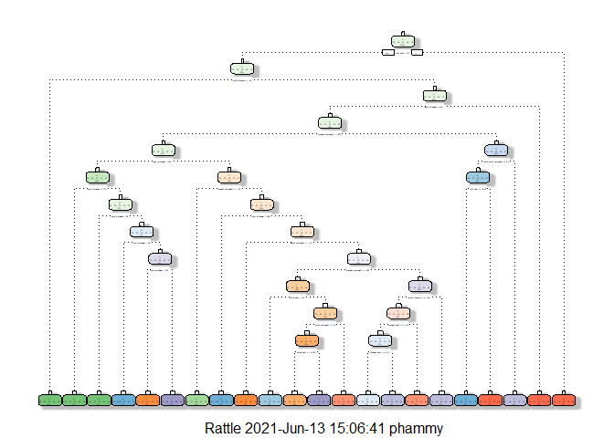

## Introduction

Large amounts of data these days are collected on personal activity via
devices like jawbone and fitbit. This allows people to easily quantify
how much they do but not how well they do these activities.

This report describes the approach and the building of the model of the
analysis on predicting on the manner to which the exercises were
performed.The prediction model will use data from accelerometers on the
belt, forearm, arm, and dumbell of 6 participants and then finally used
against 20 test scenarios.The individuals were asked to perform barbell
exercises correctly and incorrectly.

Data for this prediction model was taken from the below sites.
<http://groupware.les.inf.puc-rio.br/har>

The training data:
<https://d396qusza40orc.cloudfront.net/predmachlearn/pml-training.csv>

The test data:
<https://d396qusza40orc.cloudfront.net/predmachlearn/pml-testing.csv>

Training, Test, Validation

## Cleaning, splitting and exploring

Downloaded the data and placed it into working directory.

``` r
library(randomForest)
```

    ## randomForest 4.6-14

    ## Type rfNews() to see new features/changes/bug fixes.

``` r
library(rattle)
```

    ## Loading required package: tibble

    ## Loading required package: bitops

    ## Rattle: A free graphical interface for data science with R.
    ## Version 5.4.0 Copyright (c) 2006-2020 Togaware Pty Ltd.
    ## Type 'rattle()' to shake, rattle, and roll your data.

    ## 
    ## Attaching package: 'rattle'

    ## The following object is masked from 'package:randomForest':
    ## 
    ##     importance

``` r
library(e1071)
library(lattice)
library(ggplot2)
```

    ## 
    ## Attaching package: 'ggplot2'

    ## The following object is masked from 'package:randomForest':
    ## 
    ##     margin

``` r
library(caret)
library(rpart)
library(rpart.plot)
library(tinytex)
```

``` r
training <- read.csv("C:/pml-training.csv", header=TRUE,sep=",")
testing <- read.csv("C:/pml-testing.csv", header=TRUE,sep=",")
```

Before doing anything, quick over view of the training data.

``` r
str(training)
```

    ## 'data.frame':    19622 obs. of  160 variables:
    ##  $ X                       : int  1 2 3 4 5 6 7 8 9 10 ...
    ##  $ user_name               : chr  "carlitos" "carlitos" "carlitos" "carlitos" ...
    ##  $ raw_timestamp_part_1    : int  1323084231 1323084231 1323084231 1323084232 1323084232 1323084232 1323084232 1323084232 1323084232 1323084232 ...
    ##  $ raw_timestamp_part_2    : int  788290 808298 820366 120339 196328 304277 368296 440390 484323 484434 ...
    ##  $ cvtd_timestamp          : chr  "05/12/2011 11:23" "05/12/2011 11:23" "05/12/2011 11:23" "05/12/2011 11:23" ...
    ##  $ new_window              : chr  "no" "no" "no" "no" ...
    ##  $ num_window              : int  11 11 11 12 12 12 12 12 12 12 ...
    ##  $ roll_belt               : num  1.41 1.41 1.42 1.48 1.48 1.45 1.42 1.42 1.43 1.45 ...
    ##  $ pitch_belt              : num  8.07 8.07 8.07 8.05 8.07 8.06 8.09 8.13 8.16 8.17 ...
    ##  $ yaw_belt                : num  -94.4 -94.4 -94.4 -94.4 -94.4 -94.4 -94.4 -94.4 -94.4 -94.4 ...
    ##  $ total_accel_belt        : int  3 3 3 3 3 3 3 3 3 3 ...
    ##  $ kurtosis_roll_belt      : chr  "" "" "" "" ...
    ##  $ kurtosis_picth_belt     : chr  "" "" "" "" ...
    ##  $ kurtosis_yaw_belt       : chr  "" "" "" "" ...
    ##  $ skewness_roll_belt      : chr  "" "" "" "" ...
    ##  $ skewness_roll_belt.1    : chr  "" "" "" "" ...
    ##  $ skewness_yaw_belt       : chr  "" "" "" "" ...
    ##  $ max_roll_belt           : num  NA NA NA NA NA NA NA NA NA NA ...
    ##  $ max_picth_belt          : int  NA NA NA NA NA NA NA NA NA NA ...
    ##  $ max_yaw_belt            : chr  "" "" "" "" ...
    ##  $ min_roll_belt           : num  NA NA NA NA NA NA NA NA NA NA ...
    ##  $ min_pitch_belt          : int  NA NA NA NA NA NA NA NA NA NA ...
    ##  $ min_yaw_belt            : chr  "" "" "" "" ...
    ##  $ amplitude_roll_belt     : num  NA NA NA NA NA NA NA NA NA NA ...
    ##  $ amplitude_pitch_belt    : int  NA NA NA NA NA NA NA NA NA NA ...
    ##  $ amplitude_yaw_belt      : chr  "" "" "" "" ...
    ##  $ var_total_accel_belt    : num  NA NA NA NA NA NA NA NA NA NA ...
    ##  $ avg_roll_belt           : num  NA NA NA NA NA NA NA NA NA NA ...
    ##  $ stddev_roll_belt        : num  NA NA NA NA NA NA NA NA NA NA ...
    ##  $ var_roll_belt           : num  NA NA NA NA NA NA NA NA NA NA ...
    ##  $ avg_pitch_belt          : num  NA NA NA NA NA NA NA NA NA NA ...
    ##  $ stddev_pitch_belt       : num  NA NA NA NA NA NA NA NA NA NA ...
    ##  $ var_pitch_belt          : num  NA NA NA NA NA NA NA NA NA NA ...
    ##  $ avg_yaw_belt            : num  NA NA NA NA NA NA NA NA NA NA ...
    ##  $ stddev_yaw_belt         : num  NA NA NA NA NA NA NA NA NA NA ...
    ##  $ var_yaw_belt            : num  NA NA NA NA NA NA NA NA NA NA ...
    ##  $ gyros_belt_x            : num  0 0.02 0 0.02 0.02 0.02 0.02 0.02 0.02 0.03 ...
    ##  $ gyros_belt_y            : num  0 0 0 0 0.02 0 0 0 0 0 ...
    ##  $ gyros_belt_z            : num  -0.02 -0.02 -0.02 -0.03 -0.02 -0.02 -0.02 -0.02 -0.02 0 ...
    ##  $ accel_belt_x            : int  -21 -22 -20 -22 -21 -21 -22 -22 -20 -21 ...
    ##  $ accel_belt_y            : int  4 4 5 3 2 4 3 4 2 4 ...
    ##  $ accel_belt_z            : int  22 22 23 21 24 21 21 21 24 22 ...
    ##  $ magnet_belt_x           : int  -3 -7 -2 -6 -6 0 -4 -2 1 -3 ...
    ##  $ magnet_belt_y           : int  599 608 600 604 600 603 599 603 602 609 ...
    ##  $ magnet_belt_z           : int  -313 -311 -305 -310 -302 -312 -311 -313 -312 -308 ...
    ##  $ roll_arm                : num  -128 -128 -128 -128 -128 -128 -128 -128 -128 -128 ...
    ##  $ pitch_arm               : num  22.5 22.5 22.5 22.1 22.1 22 21.9 21.8 21.7 21.6 ...
    ##  $ yaw_arm                 : num  -161 -161 -161 -161 -161 -161 -161 -161 -161 -161 ...
    ##  $ total_accel_arm         : int  34 34 34 34 34 34 34 34 34 34 ...
    ##  $ var_accel_arm           : num  NA NA NA NA NA NA NA NA NA NA ...
    ##  $ avg_roll_arm            : num  NA NA NA NA NA NA NA NA NA NA ...
    ##  $ stddev_roll_arm         : num  NA NA NA NA NA NA NA NA NA NA ...
    ##  $ var_roll_arm            : num  NA NA NA NA NA NA NA NA NA NA ...
    ##  $ avg_pitch_arm           : num  NA NA NA NA NA NA NA NA NA NA ...
    ##  $ stddev_pitch_arm        : num  NA NA NA NA NA NA NA NA NA NA ...
    ##  $ var_pitch_arm           : num  NA NA NA NA NA NA NA NA NA NA ...
    ##  $ avg_yaw_arm             : num  NA NA NA NA NA NA NA NA NA NA ...
    ##  $ stddev_yaw_arm          : num  NA NA NA NA NA NA NA NA NA NA ...
    ##  $ var_yaw_arm             : num  NA NA NA NA NA NA NA NA NA NA ...
    ##  $ gyros_arm_x             : num  0 0.02 0.02 0.02 0 0.02 0 0.02 0.02 0.02 ...
    ##  $ gyros_arm_y             : num  0 -0.02 -0.02 -0.03 -0.03 -0.03 -0.03 -0.02 -0.03 -0.03 ...
    ##  $ gyros_arm_z             : num  -0.02 -0.02 -0.02 0.02 0 0 0 0 -0.02 -0.02 ...
    ##  $ accel_arm_x             : int  -288 -290 -289 -289 -289 -289 -289 -289 -288 -288 ...
    ##  $ accel_arm_y             : int  109 110 110 111 111 111 111 111 109 110 ...
    ##  $ accel_arm_z             : int  -123 -125 -126 -123 -123 -122 -125 -124 -122 -124 ...
    ##  $ magnet_arm_x            : int  -368 -369 -368 -372 -374 -369 -373 -372 -369 -376 ...
    ##  $ magnet_arm_y            : int  337 337 344 344 337 342 336 338 341 334 ...
    ##  $ magnet_arm_z            : int  516 513 513 512 506 513 509 510 518 516 ...
    ##  $ kurtosis_roll_arm       : chr  "" "" "" "" ...
    ##  $ kurtosis_picth_arm      : chr  "" "" "" "" ...
    ##  $ kurtosis_yaw_arm        : chr  "" "" "" "" ...
    ##  $ skewness_roll_arm       : chr  "" "" "" "" ...
    ##  $ skewness_pitch_arm      : chr  "" "" "" "" ...
    ##  $ skewness_yaw_arm        : chr  "" "" "" "" ...
    ##  $ max_roll_arm            : num  NA NA NA NA NA NA NA NA NA NA ...
    ##  $ max_picth_arm           : num  NA NA NA NA NA NA NA NA NA NA ...
    ##  $ max_yaw_arm             : int  NA NA NA NA NA NA NA NA NA NA ...
    ##  $ min_roll_arm            : num  NA NA NA NA NA NA NA NA NA NA ...
    ##  $ min_pitch_arm           : num  NA NA NA NA NA NA NA NA NA NA ...
    ##  $ min_yaw_arm             : int  NA NA NA NA NA NA NA NA NA NA ...
    ##  $ amplitude_roll_arm      : num  NA NA NA NA NA NA NA NA NA NA ...
    ##  $ amplitude_pitch_arm     : num  NA NA NA NA NA NA NA NA NA NA ...
    ##  $ amplitude_yaw_arm       : int  NA NA NA NA NA NA NA NA NA NA ...
    ##  $ roll_dumbbell           : num  13.1 13.1 12.9 13.4 13.4 ...
    ##  $ pitch_dumbbell          : num  -70.5 -70.6 -70.3 -70.4 -70.4 ...
    ##  $ yaw_dumbbell            : num  -84.9 -84.7 -85.1 -84.9 -84.9 ...
    ##  $ kurtosis_roll_dumbbell  : chr  "" "" "" "" ...
    ##  $ kurtosis_picth_dumbbell : chr  "" "" "" "" ...
    ##  $ kurtosis_yaw_dumbbell   : chr  "" "" "" "" ...
    ##  $ skewness_roll_dumbbell  : chr  "" "" "" "" ...
    ##  $ skewness_pitch_dumbbell : chr  "" "" "" "" ...
    ##  $ skewness_yaw_dumbbell   : chr  "" "" "" "" ...
    ##  $ max_roll_dumbbell       : num  NA NA NA NA NA NA NA NA NA NA ...
    ##  $ max_picth_dumbbell      : num  NA NA NA NA NA NA NA NA NA NA ...
    ##  $ max_yaw_dumbbell        : chr  "" "" "" "" ...
    ##  $ min_roll_dumbbell       : num  NA NA NA NA NA NA NA NA NA NA ...
    ##  $ min_pitch_dumbbell      : num  NA NA NA NA NA NA NA NA NA NA ...
    ##  $ min_yaw_dumbbell        : chr  "" "" "" "" ...
    ##  $ amplitude_roll_dumbbell : num  NA NA NA NA NA NA NA NA NA NA ...
    ##   [list output truncated]

When doing regression or predictive modeling, we should only be using
complete cases, removing any predictors with missing values and in some
cases we can replace missing values with appropriate values to prevent
too much loss of data that may affect the accuracy/outcome of the
models.

The str function above showed that the dataset contained a large number
of NAs, so in this case we will remove these columns.

``` r
training <- training[ , colSums(is.na(training)) == 0]
```

Also removing any zero or near zero numbers by using the nearZeroVar
function available within the caret package. This will be a quick way
for us get rid of predictors that are not very informative, this
approach isn’t always the best but we will use it in this case.

``` r
NZVar <- nearZeroVar(training)
training <- training[,-NZVar]
```

The first five columns wont be used in our analysis as they are
identifiers and time stamps we don’t need.

``` r
training <- training[,-(1:5)]
```

Now splitting the training data.Splitting into 75% used for training and
25% for testing. The testing data will be used later for the 20 test
scenarios.

``` r
inTrain  <- createDataPartition(training$classe, p=0.75, list=FALSE)
TrainSet <- training[inTrain, ]
TestSet  <- training[-inTrain, ]
```

``` r
dim(TrainSet)
```

    ## [1] 14718    54

``` r
dim(TestSet)
```

    ## [1] 4904   54

``` r
summary(TrainSet$classe)
```

    ##    Length     Class      Mode 
    ##     14718 character character

``` r
#boxplot(TrainSet$classe,col="blue")
```

## First Method - Predictive tree

Using rpart package, rather than train function in caret as rattle
package outputted an error that the object must be an rpart object.So
using the rpart function to grow the decision tree and method is class
for classifcation tree.

``` r
set.seed(1379)
#modFit <- train(classe ~ ., method ="rpart", data = TrainSet)
#print(modFit$finalModel)
#plot(modFit$finalModel)
modFit <- rpart(classe ~ .,method="class",data=TrainSet)
#plot(modFit, uniform = TRUE, main="Classification Tree for Classe")
fancyRpartPlot(modFit) 
```



Now testing the model on the small test set that was partitioned from
the original training set and then using the confusionMatrix function to
examine the output of the model and outcomes of the predictions.

``` r
Predict <- predict(modFit, type="class",newdata=TestSet)
DT <- confusionMatrix(Predict, as.factor(TestSet$classe))
DT
```

    ## Confusion Matrix and Statistics
    ## 
    ##           Reference
    ## Prediction    A    B    C    D    E
    ##          A 1229  123   28   26   10
    ##          B   69  655  111   45   55
    ##          C   23   58  697  101   34
    ##          D   67   94   18  553   81
    ##          E    7   19    1   79  721
    ## 
    ## Overall Statistics
    ##                                           
    ##                Accuracy : 0.7861          
    ##                  95% CI : (0.7743, 0.7975)
    ##     No Information Rate : 0.2845          
    ##     P-Value [Acc > NIR] : < 2.2e-16       
    ##                                           
    ##                   Kappa : 0.7293          
    ##                                           
    ##  Mcnemar's Test P-Value : < 2.2e-16       
    ## 
    ## Statistics by Class:
    ## 
    ##                      Class: A Class: B Class: C Class: D Class: E
    ## Sensitivity            0.8810   0.6902   0.8152   0.6878   0.8002
    ## Specificity            0.9467   0.9292   0.9467   0.9366   0.9735
    ## Pos Pred Value         0.8679   0.7005   0.7634   0.6802   0.8718
    ## Neg Pred Value         0.9524   0.9259   0.9604   0.9386   0.9558
    ## Prevalence             0.2845   0.1935   0.1743   0.1639   0.1837
    ## Detection Rate         0.2506   0.1336   0.1421   0.1128   0.1470
    ## Detection Prevalence   0.2887   0.1907   0.1862   0.1658   0.1686
    ## Balanced Accuracy      0.9139   0.8097   0.8809   0.8122   0.8869

## Second Method - Random Forest

This method generates many bootstrapped trees, similar to bagging in
that we do bootstrap samples but at each split only a subset of
variables are considered. This allows us to grow a large number of
prediction trees and average the predictions to get the predictive
probability of each class.

``` r
set.seed(1379)
TC <- trainControl(method="cv", number = 5, verboseIter=FALSE) 
## verboseIter False, do not want log.
## we are setting the controls of the below model with the above variable
modFitRF <- train(classe ~ ., data = TrainSet, method ="rf",trControl= TC, prox=TRUE)
# removed getTree from run, to long to show
#getTree(modFitRF$finalModel,k=3)
```

Random Forest Prediction

``` r
PredictRF <- predict(modFitRF, newdata=TestSet)
RF <- confusionMatrix(PredictRF, as.factor(TestSet$classe))
RF
```

    ## Confusion Matrix and Statistics
    ## 
    ##           Reference
    ## Prediction    A    B    C    D    E
    ##          A 1394    1    0    0    0
    ##          B    1  947    2    0    0
    ##          C    0    0  853    2    0
    ##          D    0    1    0  801    0
    ##          E    0    0    0    1  901
    ## 
    ## Overall Statistics
    ##                                           
    ##                Accuracy : 0.9984          
    ##                  95% CI : (0.9968, 0.9993)
    ##     No Information Rate : 0.2845          
    ##     P-Value [Acc > NIR] : < 2.2e-16       
    ##                                           
    ##                   Kappa : 0.9979          
    ##                                           
    ##  Mcnemar's Test P-Value : NA              
    ## 
    ## Statistics by Class:
    ## 
    ##                      Class: A Class: B Class: C Class: D Class: E
    ## Sensitivity            0.9993   0.9979   0.9977   0.9963   1.0000
    ## Specificity            0.9997   0.9992   0.9995   0.9998   0.9998
    ## Pos Pred Value         0.9993   0.9968   0.9977   0.9988   0.9989
    ## Neg Pred Value         0.9997   0.9995   0.9995   0.9993   1.0000
    ## Prevalence             0.2845   0.1935   0.1743   0.1639   0.1837
    ## Detection Rate         0.2843   0.1931   0.1739   0.1633   0.1837
    ## Detection Prevalence   0.2845   0.1937   0.1743   0.1635   0.1839
    ## Balanced Accuracy      0.9995   0.9986   0.9986   0.9980   0.9999

## Third Method - Generalised Boost Method

This method is a combination of Decision Trees and Boosting, like Random
forests it generates many trees but the random subset of data is
selected using the boosting method, weighting heavier the missed data
points in the previous tree modeling until the accuracy of the model is
improved.

``` r
set.seed(1379)
modFitB <- train(classe ~ ., method= "gbm", data= TrainSet, verbose = FALSE)
#print(modFitB)
```

Testing the model with the small TestSet we created earlier from
Training data.

``` r
#qplot(predict(modFitB, TestSet),classe, data=TestSet)
PredictGBM <- predict(modFitB, newdata=TestSet)
GBM <- confusionMatrix(PredictGBM, as.factor(TestSet$classe))
GBM
```

    ## Confusion Matrix and Statistics
    ## 
    ##           Reference
    ## Prediction    A    B    C    D    E
    ##          A 1391    7    0    0    0
    ##          B    4  933   10    3    4
    ##          C    0    9  843    9    2
    ##          D    0    0    2  792    7
    ##          E    0    0    0    0  888
    ## 
    ## Overall Statistics
    ##                                          
    ##                Accuracy : 0.9884         
    ##                  95% CI : (0.985, 0.9912)
    ##     No Information Rate : 0.2845         
    ##     P-Value [Acc > NIR] : < 2.2e-16      
    ##                                          
    ##                   Kappa : 0.9853         
    ##                                          
    ##  Mcnemar's Test P-Value : NA             
    ## 
    ## Statistics by Class:
    ## 
    ##                      Class: A Class: B Class: C Class: D Class: E
    ## Sensitivity            0.9971   0.9831   0.9860   0.9851   0.9856
    ## Specificity            0.9980   0.9947   0.9951   0.9978   1.0000
    ## Pos Pred Value         0.9950   0.9780   0.9768   0.9888   1.0000
    ## Neg Pred Value         0.9989   0.9959   0.9970   0.9971   0.9968
    ## Prevalence             0.2845   0.1935   0.1743   0.1639   0.1837
    ## Detection Rate         0.2836   0.1903   0.1719   0.1615   0.1811
    ## Detection Prevalence   0.2851   0.1945   0.1760   0.1633   0.1811
    ## Balanced Accuracy      0.9976   0.9889   0.9905   0.9914   0.9928

## Applying the chosen model on Test data

So the prediction model of choice is Random Forest, out doing the
Decision Tree and General Boost Method in accuracy. Decision Tree -
Accuracy 74.2% Random Forest - Accuracy 99.8% General Boost Method -
Accuracy 98.8%

``` r
predict(modFitRF, newdata= testing)
```

    ##  [1] B A B A A E D B A A B C B A E E A B B B
    ## Levels: A B C D E
